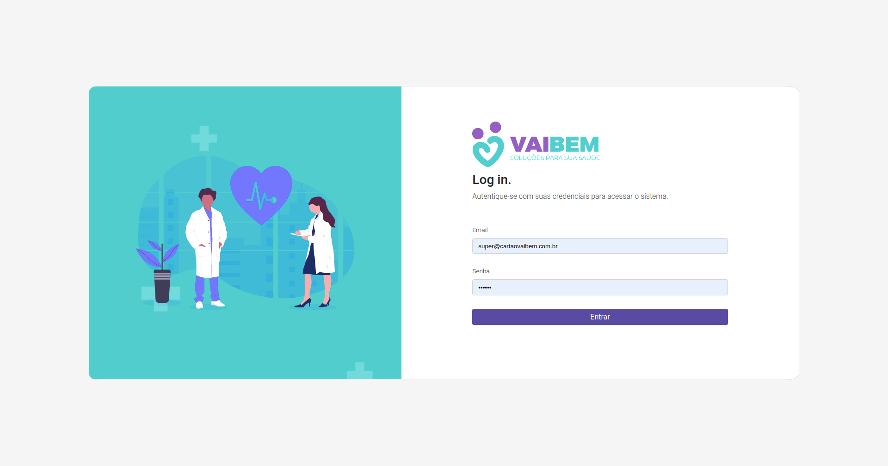
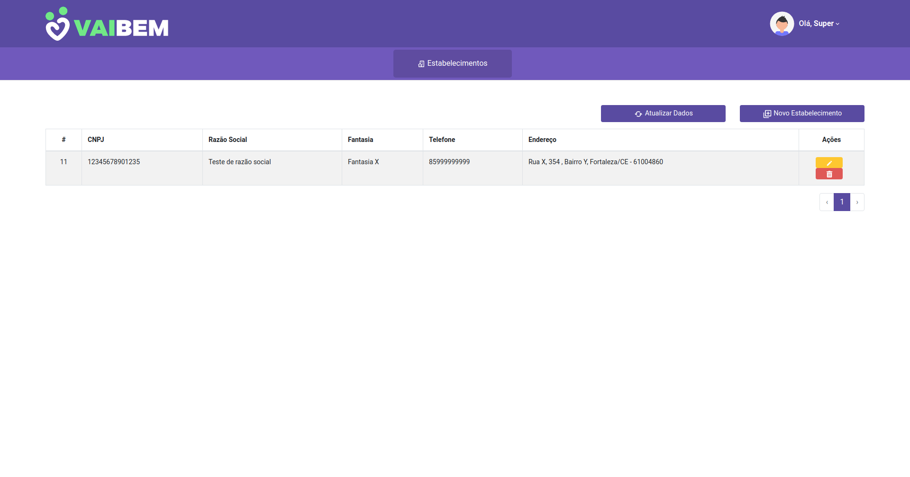
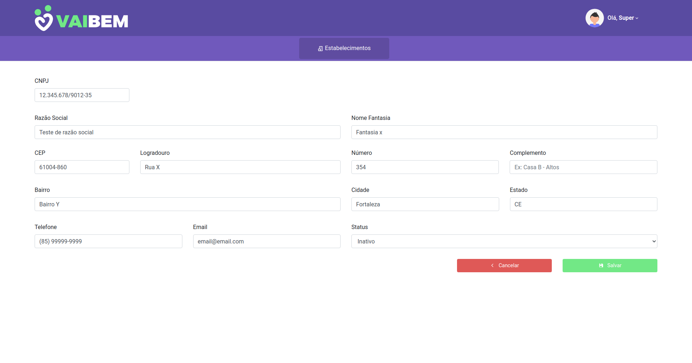
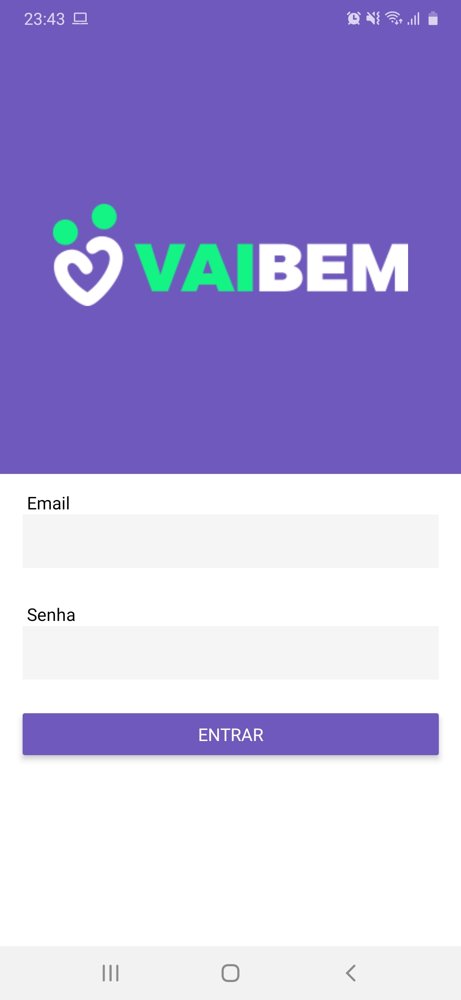
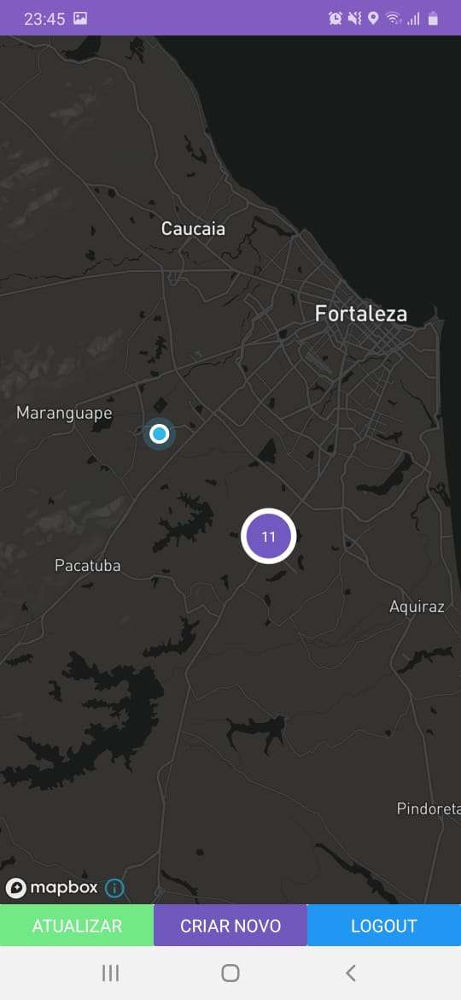
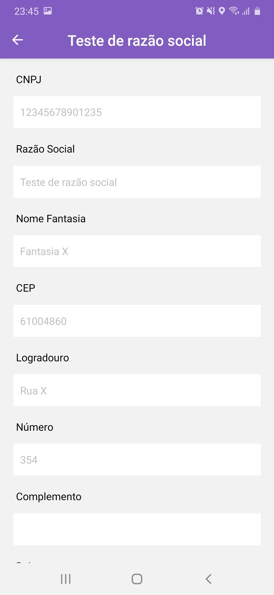
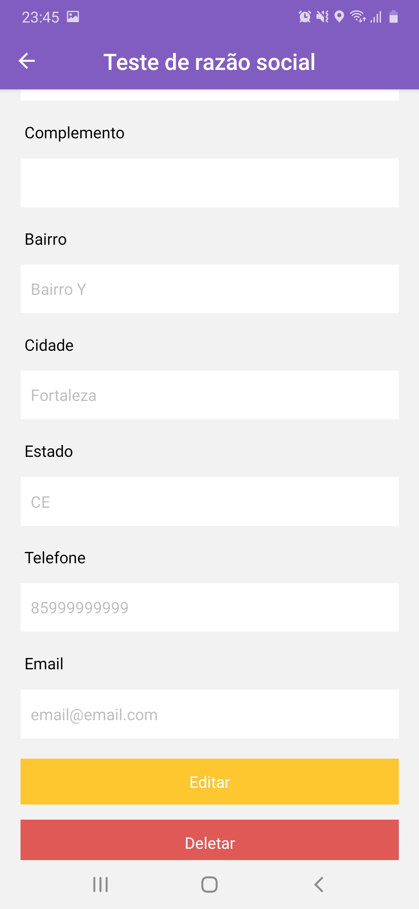

# Sobre o projeto

O Projeto é um sistema gerenciador de estabelecimentos, desenvolvido para seleção na empresa Vai Bem, para vaga de Desenvolvedor Fullstack. Para este projeto temos 3 aplicativos: Backend (Node), Frontend (React) e Mobile(React Native).

Nas pastas de cada projeto encontra-se os respectivos READMEs explicando sobre os mesmos, as tecnologias utilizadas e o modo de instalação.

# DEMO

Você pode acessar a demo do sistema web funcionando no seguinte endereço: http://159.89.229.132:8008

Para acessar o sistema você pode utilizar uma das seguintes credenciais:

**Usuário administrador**:

- **Email**: super@cartaovaibem.com.br
- **Senha**: 123456

**Usuário limitado**:

- **Email**: super@cartaovaibem.com.br
- **Senha**: 123456

# Screenshots

- ## Sistema Web

- ## Sistema Mobile

# Mobile executando

[Video do mobile sendo executado](mobile-runing.mp4)
